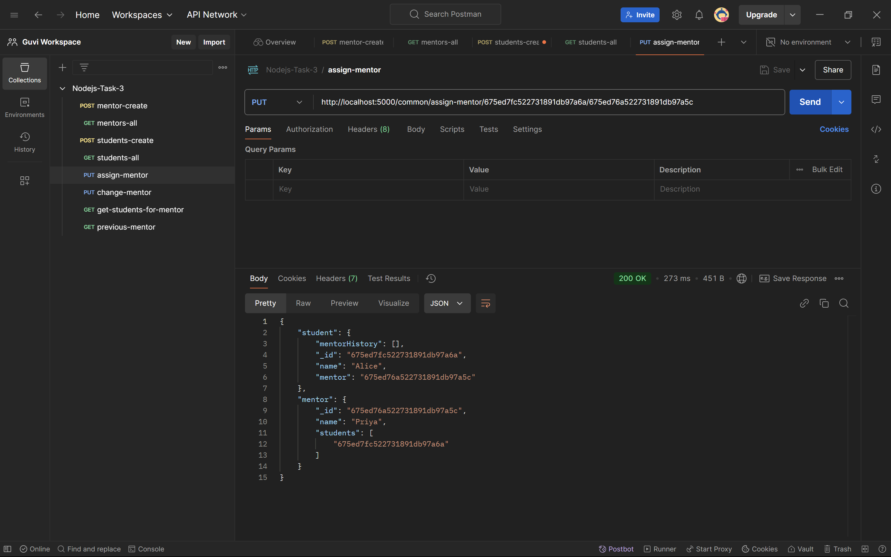
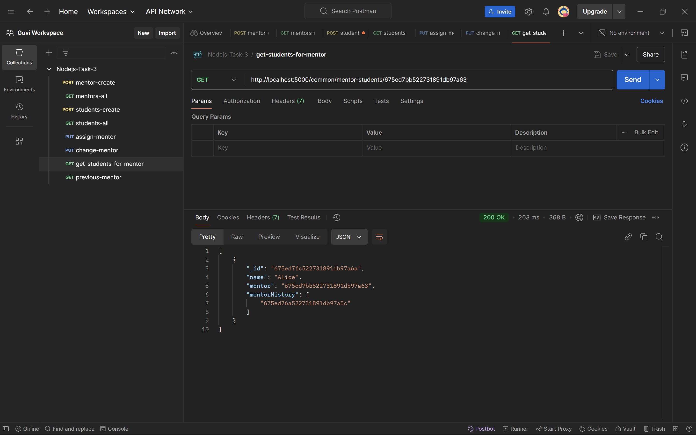

# Mentor-Student Relationship Management API

The **Mentor-Student Relationship Management API** helps manage mentor-student relationships efficiently. It supports creating mentors and students, assigning relationships, and retrieving data.

## Deployed URL's
https://assign-mentor-slgs.onrender.com/

   1. CREATE MENTOR - https://assign-mentor-slgs.onrender.com/mentors/create

   2. GET ALL MENTORS - https://assign-mentor-slgs.onrender.com/mentors/all

   3. CREATE STUDENT - https://assign-mentor-slgs.onrender.com/students/create

   4. GET ALL STUDENTS - https://assign-mentor-slgs.onrender.com/students/all
   
   5. ASSIGN MENTOR - https://assign-mentor-slgs.onrender.com/assign-mentor/675ed7fc522731891db97a6a/675ed76a522731891db97a5c
   
   6. CHANGE MENTOR - https://assign-mentor-slgs.onrender.com/assign-or-change-mentor/675ed7fc522731891db97a6a/675ed7bb522731891db97a63
   
   7. GET STUDENTS FOR PARTICULAR MENTOR - https://assign-mentor-slgs.onrender.com/common/mentor-students/675ed7bb522731891db97a63
   
   8. PREVIOUS MENTOR - https://assign-mentor-slgs.onrender.com/previous-mentor/675ed7fc522731891db97a6a


API server hosted at:

## Key API Endpoints

1. **Create Mentor (POST)**

   - Endpoint: `/mentor/create`
   - Request Body:

     ```json
     { "name": "Priya" }
     ```

   - Postman Test: 

2. **Create Student (POST)**

   - Endpoint: `/student/create`
   - Request Body:

     ```json
     { "name": "Alice" }
     ```

   - Postman Test: 

3. **Assign Student to Mentor (POST)**

   - Endpoint: `/assignment/assignStudent/:mentorId/:studentId`

   - Postman Test: 

4. **Assign or Change Mentor for Student (PUT)**

   - Endpoint: `/assignment/assignOrChangeMentor/:studentId/:newMentorId`

   - Postman Test: 

5. **Get All Students for a Mentor (GET)**

   - Endpoint: `/mentor/getAllStudents/:mentorId`

   - Postman Test: 

6. **Get Previously Assigned Mentor for a Student (GET)**

   - Endpoint: `/student/getPreviousMentor/:studentId`

   - Postman Test: 
